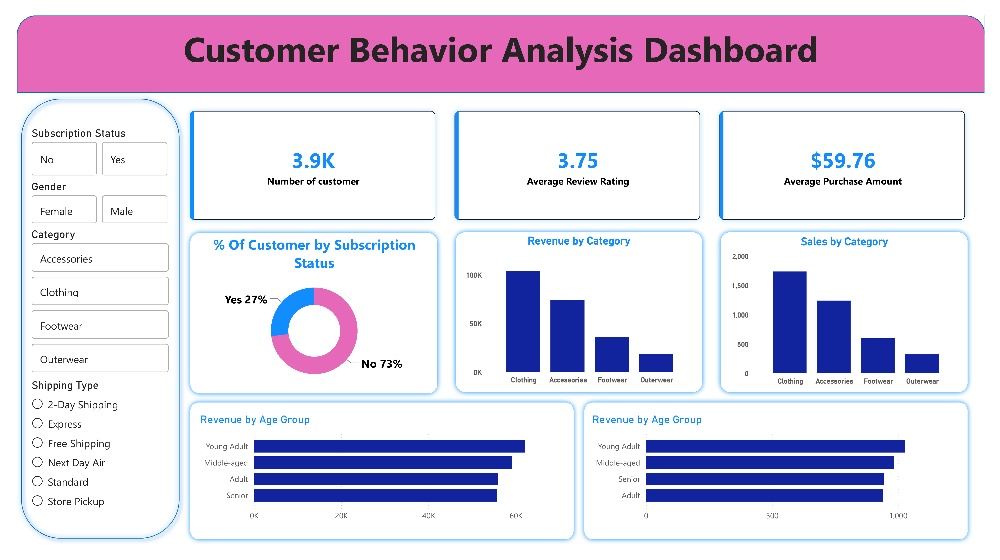

# 📊 Customer Behavior Data Analytics Project


An end-to-end data analytics project that analyzes customer shopping behavior using **Python**, **MySQL**, and **Power BI**. The project demonstrates a complete analytics workflow, including data preparation, SQL-based business analysis, and interactive dashboard development to generate actionable business insights.

---

# 📌 Project Overview

Customer behavior analysis helps businesses understand purchasing patterns, customer preferences, and revenue trends. These insights enable organizations to make informed decisions regarding marketing strategies, inventory management, customer retention, and business growth.

In this project, customer shopping data was processed using Python, analyzed through SQL queries, and visualized using an interactive Power BI dashboard.

---

# 🎯 Objectives

- Prepare and organize customer shopping data using Python.
- Answer business-driven questions using SQL.
- Build an interactive Power BI dashboard.
- Identify customer purchasing trends.
- Generate meaningful business insights for decision-making.

---

# 🛠️ Tech Stack

| Technology | Purpose |
|------------|----------|
| Python | Data Preparation |
| Pandas | Data Manipulation |
| NumPy | Numerical Operations |
| MySQL | Business Analysis |
| Power BI | Interactive Dashboard |
| Git & GitHub | Version Control |

---

# 📂 Dataset

The dataset contains customer shopping information, including:

- Customer ID
- Age
- Gender
- Product Category
- Item Purchased
- Purchase Amount
- Payment Method
- Shipping Type
- Subscription Status
- Review Rating
- Discount Applied
- Previous Purchases

---

# 📈 Project Workflow

```text
Business Problem
        │
        ▼
Data Collection
        │
        ▼
Data Preparation (Python)
        │
        ▼
SQL Business Analysis
        │
        ▼
Power BI Dashboard
        │
        ▼
Business Insights
```

---

# 🔍 SQL Business Analysis

The SQL analysis answers several real-world business questions, including:

- Total revenue generated by male and female customers
- Customers who spent above the average purchase amount despite using discounts
- Top-rated products based on customer reviews
- Purchase comparison between Express and Standard shipping
- Products with the highest discount usage
- Customer segmentation based on purchase history
- Top-selling products within each category
- Subscription behavior of repeat customers
- Revenue contribution across different age groups

### SQL Concepts Used

- Aggregate Functions
- GROUP BY
- ORDER BY
- CASE Statements
- Subqueries
- Common Table Expressions (CTEs)
- Window Functions (`ROW_NUMBER()`)

---

# 📊 Dashboard Preview

> Replace the image below with your dashboard screenshot.



---

# 📌 Dashboard Features

The interactive dashboard provides insights into:

- Total Customers
- Average Purchase Amount
- Average Review Rating
- Revenue by Product Category
- Sales Distribution by Category
- Customer Subscription Distribution
- Revenue by Age Group
- Interactive Filters
  - Gender
  - Category
  - Shipping Type
  - Subscription Status

---

# 💡 Key Business Insights

- Clothing generated the highest overall revenue.
- Most customers were non-subscribers.
- Young Adult customers contributed the highest revenue.
- Discount campaigns influenced purchasing behavior across several product categories.
- Customer spending patterns varied based on age, product category, and subscription status.

---

# 📁 Repository Structure

```text
customer-behavior-analysis/
│
├── data/
│   └── customer_shopping_behavior.csv
│
├── notebook/
│   └── Customer_Shopping_Behavior_Analysis.ipynb
│
├── sql/
│   └── customer_behavior_sql_queries.sql
│
├── dashboard/
│   └── Customer_Behavior_Dashboard.pbix
│
├── images/
│   └── dashboard.png
│
├── requirements.txt
└── README.md
```

---

# 🚀 Getting Started

### Clone the Repository

```bash
git clone https://github.com/yourusername/customer-behavior-analysis.git
```

### Install Required Libraries

```bash
pip install -r requirements.txt
```

### Open the Project

- Run the Jupyter Notebook.
- Execute the SQL script in MySQL.
- Open the Power BI dashboard (.pbix).

---

# 📚 Skills Demonstrated

- Data Preparation
- SQL Query Writing
- Customer Segmentation
- Revenue Analysis
- Dashboard Development
- Business Intelligence
- Data Visualization
- Git & GitHub

---

# 🔮 Future Improvements

- Build a predictive machine learning model for customer purchase behavior.
- Deploy the dashboard using Power BI Service.
- Automate data updates using ETL pipelines.
- Integrate real-time customer data for continuous analysis.

---

# 👨‍💻 Author

**Daksh Maheshwari**

Electronics & Communication Engineering Undergraduate

Interested in Data Analytics, Machine Learning, FPGA, and Embedded Systems.

**LinkedIn:**  
https://www.linkedin.com/in/daksh-maheshwari-48612328a/

---

## Acknowledgement

This project was completed as part of a guided learning experience to strengthen practical skills in Python, SQL, and Power BI. The implementation and documentation in this repository reflect my understanding and hands-on practice of the complete analytics workflow.

---

## ⭐ If you found this project interesting, consider giving it a star!
